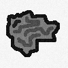

# ghost imaging simulation

Script to simulate ghost imaging, a technique to reconstruct an image $R(x,y)$ from $N$ repeated intensity measurements $I_i$ with a bucket detector (camera without pixels) of an unkown sample (desired image) and known random masks $M_i(x,y)$.

The image can be obtained by calculating
$$
R(x, y) = 1/N \sum^N_i (I_i - E[I])M_i(x,y)
$$
where $E[I]$ is the expectation value of the measured intensity.

The script can run either "fast" (jit-compiled with numba and running in parallel) or with a live plot of the evolving reconstructed image.

## usage
```bash
$ pip install numpy matplotlib numba
$ python ghost_imaging_simulation.py --help                  
usage: ghost_imaging_simulation.py [-h] [-n N] [--fast] [--out OUT] input

positional arguments:
  input

options:
  -h, --help  show this help message and exit
  -n N        number of masks
  --fast      run parallel, no live plotting
  --out OUT   filename for reconstructed image
```

## example
```bash
python ghost_imaging_simulation.py input.bmp -n 1000000
```


this is the reconstructed image using 10 million masks:


